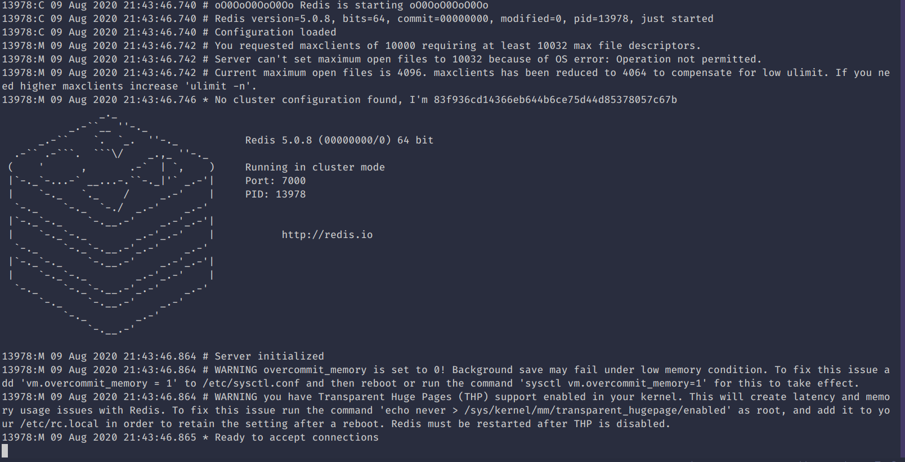

# REDIS 

- __Connection__
  - go to redis folder
    - `cd redis-5.0.8`
  - run server
    - `src/redis-server`
  - run cli
    - `src/redis-cli`

> __NOTES__
  - Redis requires two TCP ports
    - One for client serve, like 6379
    - One internal data port, client port + 1000, like 16379
      - this higher port is used for __cluster bus__ 
        - __cluster bus__ is a node-to-node communication channel using a *binary protocol* used for 
        failure detection, configuration update, failover authorization
        - *binary port* is used because of little bandwidth and processing time.

__REDIS CLUSTER__
  - Redis cluster provides a way to run redis where data is **automatically shared across multiple Redis Node**
  - TODO: what is **Redis Node**?
  - This enables us 
    - The ability to split the dataset automatically to multiple nodes
    - The ability to access data and continue operation though some part of nodes are expriencing failure 
      or cannot be connected.

__Data Sharding__
  - redis cluster doesn't use *consistent hashing* but uses *hash slot*
  - 

__Redis Cluster Master-Slave Model__
  - Redis used master-slave model to replicate data and recover possible server errors.
  - For example if we have 3 slots(A, B, C) of redis cluster to store our data, if slot `C` fails, then the operations 
  of slot `C` cann't be possible.
  - So we create some slave nodes assosiate with the master nodes [(A, A1), (B, B1), (C, C1)]. data of cluster C is coppied 
  into `C1`, and so if though cluster `C` fails, we can able to continue.

__Creating and Using Redis Cluster__
  - create a new folder and subfolders and create redis.conf in each file
    ```bash
    $ mkdir cluster-demo
    $ cd cluster demo
    $ mkdir 700{0..5}
    $ touch 700{0..5}/redis.conf
    ```
  - write the following redis.conf in each file with respective port number
    ```bash
    port 7000
    cluster-enabled yes
    cluster-config-file nodes.conf
    cluster-node-timeout 5000
    appendonly yes
    ```
  - download the latest redis from [here](https://redis.io/download) and copy the folder in your workspace folder 
  - run 
    ```bash
    $ cd 7000
    $ ../redis-5.0.8/src/redis-server ./redis.conf
    ```
  - output 
    
  - we create cluster by using redis-cli 
    - first we have to run all six instances 
    ```bash
    $ cd 7000
    $ ../redis-5.0.8/src/redis-server ./redis.conf
    ```
    - repeat this process for all 6 instances
    - then run 
    ```bash 
    $ redis-cli --cluster create  \
    127.0.0.1:7000 127.0.0.1:7001 \
    127.0.0.1:7002 127.0.0.1:7003 \
    127.0.0.1:7004 127.0.0.1:7005 \
    --cluster-replicas 1
    ```
  - output
  
    
